# LinkedIn Lead Search - Project Flow Documentation

## Overview
This document provides comprehensive flow diagrams for the LinkedIn Lead Search application, covering authentication, search operations, credit management, and admin functionality.

---

## 1. System Architecture Overview

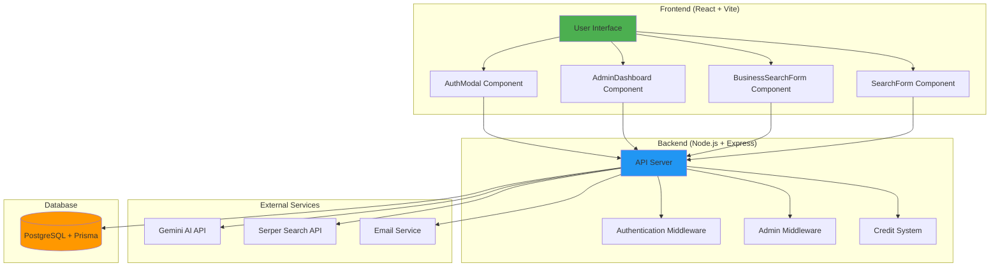

---

## 2. User Authentication Flow

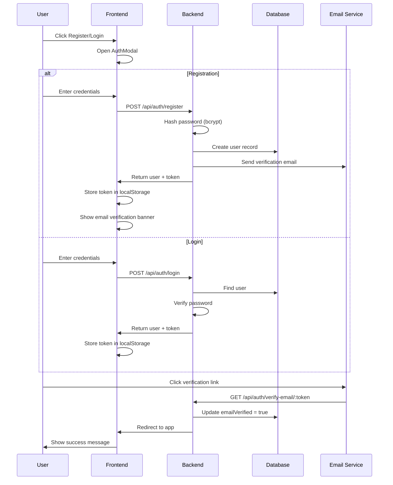

---

## 3. LinkedIn People Search Flow

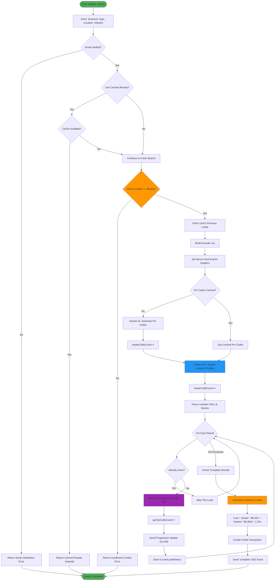

---

## 4. Business Search Flow

```mermaid
flowchart TD
    Start([User Initiates Business Search]) --> InputType{Search Type?}
    
    InputType -->|Specific Business| SpecInput[Enter: Business Name + Location]
    InputType -->|Owner Name| OwnerInput[Enter: Owner Name + Location]
    InputType -->|Business Type| TypeInput[Enter: Business Type + Location]
    
    SpecInput --> AuthCheck{Email Verified?}
    OwnerInput --> AuthCheck
    TypeInput --> AuthCheck
    
    AuthCheck -->|No| EmailError[Return Email Verification Error]
    AuthCheck -->|Yes| CacheCheck{Use Cached Results?}
    
    CacheCheck -->|Yes| HasCache{Cache Available?}
    HasCache -->|Yes| ReturnCache[Return Cached Results]
    HasCache -->|No| Proceed[Fresh Search]
    
    CacheCheck -->|No| Proceed
    Proceed --> CreditCheck{Credits >= $0.003?}
    
    CreditCheck -->|No| InsufficientError[Return Insufficient Credits Error]
    CreditCheck -->|Yes| ValidateLeads[Cap Lead Count: 1-50]
    
    ValidateLeads --> FetchHistory[Fetch Previous Business Leads]
    FetchHistory --> BuildExclude[Exclude Previously Seen]
    
    BuildExclude --> SSEHeaders[Set SSE Headers]
    SSEHeaders --> PinCodeFlow{Pin Codes Needed?}
    
    PinCodeFlow -->|Yes| CheckPinCache{Pin Code Cache?}
    CheckPinCache -->|No| GeminiPin[Gemini: Generate Pin Codes]
    CheckPinCache -->|Yes| UseCachedPin[Use Cached Pins]
    
    GeminiPin --> CountGemini1[geminiCallsCount++]
    CountGemini1 --> SerperCall
    PinCodeFlow -->|No| SerperCall[Serper API: Search Businesses]
    UseCachedPin --> SerperCall
    
    SerperCall --> CountSerper[serperCallsCount++]
    CountSerper --> ParseBusiness[Extract Business Data]
    
    ParseBusiness --> LocationFilter{Filter by Location}
    LocationFilter --> HierarchyCheck[Check: City → State → Country]
    
    HierarchyCheck --> PinCodeMatch{Pin Code in Range?}
    PinCodeMatch -->|Yes| KeepLead[Include Lead]
    PinCodeMatch -->|No| SkipLead[Skip Lead]
    
    KeepLead --> CheckExclude{Already Seen?}
    CheckExclude -->|Yes| SkipLead
    CheckExclude -->|No| ContactAvailable{Has Contact Info?}
    
    ContactAvailable -->|No| GeminiEnrich[Gemini: Extract Contact Info]
    ContactAvailable -->|Yes| ParseAddress[Parse Address Components]
    
    GeminiEnrich --> CountGemini2[geminiCallsCount++]
    CountGemini2 --> ParseAddress
    
    ParseAddress --> SendSSE[Send Progressive Update]
    SendSSE --> SaveHistory[Save to UserLeadHistory]
    
    SaveHistory --> MoreResults{More Results?}
    MoreResults -->|Yes| LocationFilter
    MoreResults -->|No| CacheComplete[Cache Complete Results]
    
    CacheComplete --> DeductCredits[Calculate Actual Cost]
    DeductCredits --> CreateTransaction[Deduct Credits + Create Transaction]
    CreateTransaction --> SendComplete[Send 'complete' Event]
    
    SendComplete --> End([Search Complete])
    
    SkipLead --> MoreResults
    EmailError --> End
    InsufficientError --> End
    ReturnCache --> End
    
    style Start fill:#4CAF50
    style End fill:#4CAF50
    style CreditCheck fill:#FF9800
    style DeductCredits fill:#FF9800
    style HierarchyCheck fill:#9C27B0
```

---

## 5. Credit System Flow

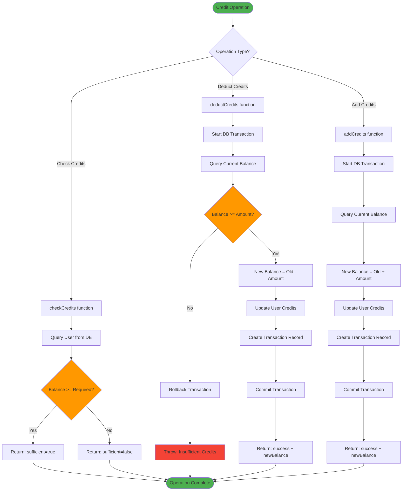

---

## 6. Admin Dashboard Flow

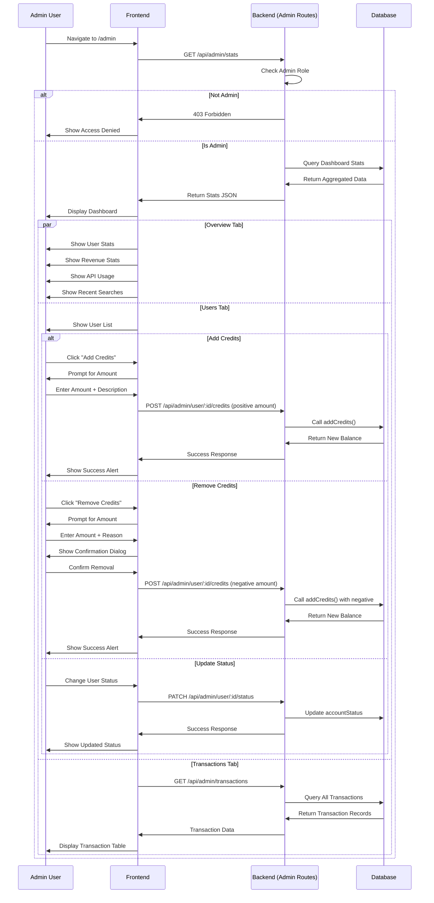

---

## 7. Query Parsing Flow

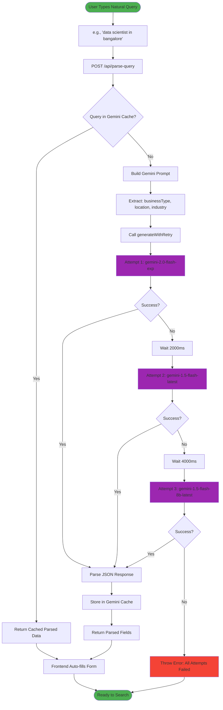

---

## 8. Pin Code Generation Flow

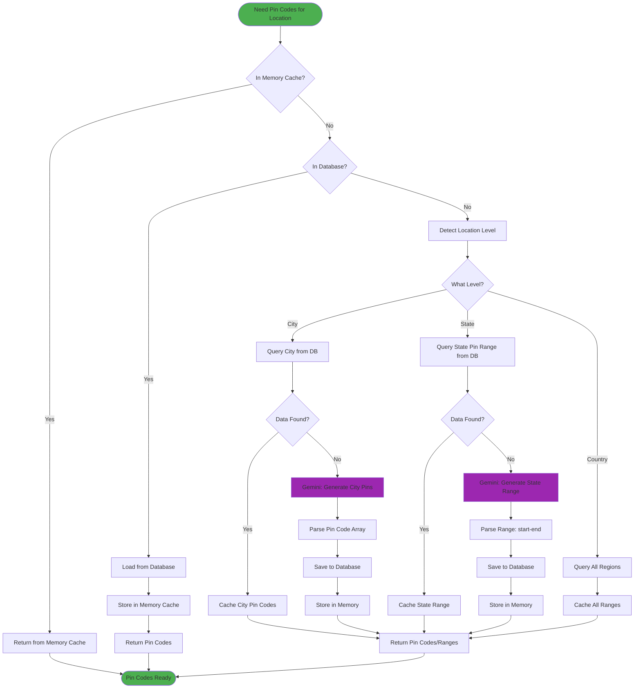

---

## 9. API Cost Calculation

```mermaid
flowchart LR
    Start([Search Completed]) --> CountAPIs[Count API Calls]
    
    CountAPIs --> SerperCalls[Serper Calls Count]
    CountAPIs --> GeminiCalls[Gemini Calls Count]
    
    SerperCalls --> CalcSerper["Serper Cost = count × $0.001"]
    GeminiCalls --> CalcGemini["Gemini Cost = count × $0.0001"]
    
    CalcSerper --> SumActual[Actual Cost = Serper + Gemini]
    CalcGemini --> SumActual
    
    SumActual --> ApplyMarkup["Charged Cost = Actual × 1.25"]
    
    ApplyMarkup --> RoundCost[Round to 6 Decimals]
    RoundCost --> DeductFromUser[Deduct Charged Cost from User]
    
    DeductFromUser --> CreateRecord[Create Transaction Record]
    CreateRecord --> RecordDetails["Store: serperCalls, geminiCalls, costs, resultCount"]
    
    RecordDetails --> End([Credit Deduction Complete])
    
    style Start fill:#4CAF50
    style End fill:#4CAF50
    style ApplyMarkup fill:#FF9800
```

---

## 10. Hierarchical Location Matching

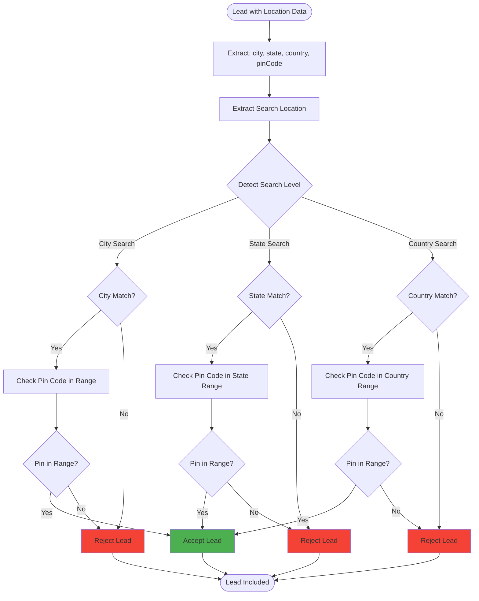

---

## 11. Data Models

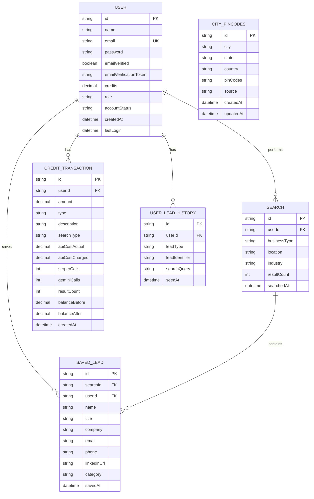

---

## 12. Key Features Summary

### Authentication & Authorization
- ✅ JWT-based authentication
- ✅ Email verification required
- ✅ Role-based access (user/admin)
- ✅ Account status management (active/suspended/deleted)

### Search Capabilities
- ✅ LinkedIn people search (by business type + location + industry)
- ✅ Business search (by type, specific name, or owner name)
- ✅ Natural language query parsing via Gemini AI
- ✅ Progressive results via Server-Sent Events (SSE)
- ✅ Duplicate detection and exclusion
- ✅ Hierarchical location filtering (city/state/country)

### Credit System
- ✅ Pay-per-search model
- ✅ Upfront credit check before API calls
- ✅ Accurate cost calculation (Serper + Gemini with 1.25x markup)
- ✅ Transaction history tracking
- ✅ Insufficient balance prevention

### Caching Strategy
- ✅ 3-tier caching: Memory → Database → AI
- ✅ Gemini response cache (1 hour TTL)
- ✅ Complete results cache (1 hour TTL)
- ✅ Pin code cache (24 hours TTL)

### Admin Features
- ✅ Dashboard with statistics
- ✅ User management
- ✅ Credit management (add/remove)
- ✅ Transaction monitoring
- ✅ API usage tracking

### Error Handling
- ✅ Exponential backoff retry (2s → 4s → 8s)
- ✅ Fallback AI models (gemini-2.0-flash-exp → gemini-1.5-flash-latest → gemini-1.5-flash-8b-latest)
- ✅ Graceful degradation
- ✅ User-friendly error messages

---

## Technology Stack

- **Frontend**: React 18, Vite, TailwindCSS, Lucide Icons
- **Backend**: Node.js, Express.js, Prisma ORM
- **Database**: PostgreSQL
- **AI/ML**: Google Gemini AI (gemini-2.0-flash-exp)
- **Search API**: Serper.dev API
- **Authentication**: JWT + bcrypt
- **Real-time**: Server-Sent Events (SSE)
- **Email**: Custom email service with verification
